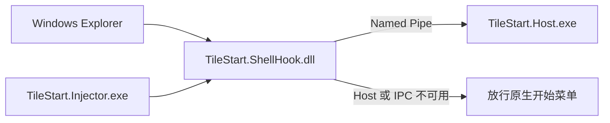

<div align="center">

# TileStart

**把 Windows 10 的磁贴开始菜单带到 Windows 10 / 11，并让每一块磁贴真正属于你。**

[](https://github.com/Narylr350/TileStart/releases/latest)


[下载安装器](https://github.com/Narylr350/TileStart/releases/latest/download/TileStart-Setup-win-x64.exe) ·
[下载便携版](https://github.com/Narylr350/TileStart/releases/latest/download/TileStart-portable-win-x64.zip) ·
[查看最新发布](https://github.com/Narylr350/TileStart/releases/latest)

</div>

TileStart 是一个面向 Windows x64 的 **Windows 10 风格磁贴开始菜单替代程序**。它独立实现应用列表、磁贴分组、拖放布局和 Shell 接管，同时支持固定应用、便携软件、文件、文件夹、脚本、网址与自定义命令。

它不是把常见启动器套上一层磁贴皮肤，而是以真实 Windows 10 扩展开始菜单为视觉与交互参考，尽量保留熟悉的布局密度、分组方式和使用习惯。

> [!WARNING]
> 当前安装器和可执行文件尚未进行 Authenticode 代码签名，Windows Defender SmartScreen 可能显示“未知发布者”。请只从本仓库的 [Releases](https://github.com/Narylr350/TileStart/releases) 页面下载，并可使用随 Release 提供的 `SHA256SUMS.txt` 校验文件。


## 为什么做 TileStart

Windows 10 的磁贴开始菜单已经停止维护，Windows 11 又移除了这一套组织方式。TileStart 希望保留磁贴工作区的高信息密度，同时解决原版开始菜单难以管理便携软件、普通文件、脚本、网址和高度自定义图标的问题。

核心目标：

- 保留 Win10 扩展开始菜单的视觉与操作习惯。
- 在 Windows 11 上继续使用相同的磁贴工作区。
- 允许任意目标固定到应用列表或磁贴区域。
- 图标、GIF、背景、尺寸和布局都由用户控制。
- Shell 接管失败时不妨碍原生开始菜单使用。
- 所有配置保存在本地，并可完整备份和迁移。

## 功能

### 开始菜单与应用列表

- 单独按 `Win` 或点击任务栏开始按钮打开 / 关闭 TileStart。
- 保留 `Win+E/R/D/L/I/数字/方向键/Shift+S` 等系统组合键。
- 扫描用户与公共开始菜单，显示 Win32、UWP/MSIX 应用。
- 最近添加、应用文件夹、字母索引和 Windows Search 转交。
- 便携应用可加入应用列表，并提供单独的取消固定操作。
- Explorer 重启后自动恢复接管。

### 磁贴工作区

- Win10 风格磁贴组、组命名和二维组布局。
- 小 `1×1`、中 `2×2`、宽 `4×2`、大 `4×4` 四种磁贴尺寸。
- 组内重排、跨组移动、自动让位、边缘滚动和整组拖动。
- 将磁贴组成文件夹，或从现有组拆分为新组。
- 固定 `.exe`、`.lnk`、普通文件、文件夹、批处理、PowerShell、URL、UWP/MSIX 与自定义命令。
- 设置启动参数、工作目录和管理员运行。

### 图标与外观

- 使用应用默认图标、程序资源或本地图片。
- 支持 PNG、JPEG、BMP、ICO、GIF 和 SVG。
- 支持主动下载网络图标。
- 静态图片与 GIF 可作为磁贴背景。
- 自定义背景色、文字色、图标大小、图标位置、标题显示与背景缩放。
- 磁贴设置窗口提供实时预览和一键恢复默认外观。

### 备份与恢复

从通知区域右键 TileStart 图标，选择 **“备份与恢复…”**：

- 一键创建完整 `.tilestartbackup` 备份。
- 可分别选择磁贴布局、应用列表、隐藏状态、窗口偏好、图标资源和任务栏辅助快捷方式。
- 自动收集外部本地图标、GIF 与背景图片，便于换电脑迁移。
- 恢复前自动创建当前状态的安全快照。
- 支持只恢复勾选的类别，不覆盖其他配置。
- 日志和旧备份不会递归打包。
- 对恢复归档执行路径、文件数量和体积检查。

### 托盘与系统集成

- 暂停 / 恢复 Shell 接管。
- 主动打开 Windows 原生开始菜单。
- 切换登录自启动。
- 资源管理器右键“添加到 TileStart 应用列表”或“添加到 TileStart 磁贴区”。
- Host、IPC 或 Hook 不可用时采用 fail-open，放行原生行为。

## 下载与安装

最新版本：**v0.1.0**

| 文件 | 用途 |
| --- | --- |
| [`TileStart-Setup-win-x64.exe`](https://github.com/Narylr350/TileStart/releases/latest/download/TileStart-Setup-win-x64.exe) | 推荐。管理员安装，默认进入 `C:\Program Files\TileStart`，安装向导可修改目录 |
| [`TileStart-portable-win-x64.zip`](https://github.com/Narylr350/TileStart/releases/latest/download/TileStart-portable-win-x64.zip) | Self-contained 便携版本，无需另装 .NET 运行时 |
| [`SHA256SUMS.txt`](https://github.com/Narylr350/TileStart/releases/latest/download/SHA256SUMS.txt) | Release 附件的 SHA-256 校验值 |

### 安装版

1. 从 Releases 下载 `TileStart-Setup-win-x64.exe`。
2. 运行安装器并通过 UAC 确认。
3. 按需修改安装目录、登录自启动和桌面快捷方式选项。
4. 安装后运行 TileStart；程序会常驻通知区域。

升级时直接运行新版本安装器即可。卸载会删除程序文件、Shell 右键菜单和安装器创建的自启动项，但保留 `%LOCALAPPDATA%\TileStart` 中的用户配置。

### 便携版

1. 解压 `TileStart-portable-win-x64.zip` 到普通可写目录。
2. 运行 `TileStart.Host.exe`。
3. 不要只复制 Host；`TileStart.Injector.exe` 与 `TileStart.ShellHook.dll` 必须留在同一目录。

## 快速使用

- **打开菜单**：按一次 `Win`，或点击任务栏开始按钮。
- **固定应用**：在左侧应用列表右键应用，添加到磁贴区域。
- **固定便携软件**：在资源管理器右键 `.exe` / `.lnk`，添加到应用列表或磁贴区域。
- **固定任意项目**：将文件、文件夹、脚本或网址拖入磁贴区。
- **调整布局**：拖动磁贴或磁贴组；将磁贴拖到另一块磁贴上可组成文件夹。
- **自定义磁贴**：右键磁贴打开 TileStart 设置。
- **暂时恢复原版**：右键通知区域图标，暂停接管或打开原生开始菜单。
- **备份配置**：右键通知区域图标，打开备份与恢复。

## 数据位置

TileStart 的用户数据保存在：

```text
%LOCALAPPDATA%\TileStart
```

主要内容：

```text
layout.json          磁贴与分组布局
custom-apps.json     手动添加的应用
hidden-apps.json     应用隐藏状态
window.json          窗口尺寸
navigation.json      导航偏好
icons\               网络、SVG 与恢复后的受管图标
backups\             恢复前自动创建的安全快照
TileStart.log        本地诊断日志
```

## 兼容性

首轮持续实机验证环境：

```text
Windows 10 Pro for Workstations
22H2 build 19045 x64
2560 × 1600
150% DPI
240 Hz
任务栏位于底部
```

TileStart 的目标平台是 Windows 10 / 11 x64，但 Shell 接管与 Windows build 强相关：

- Windows 10 build 19045 是当前主要验证环境。
- Windows 11 将使用独立适配路径，并在设备升级后继续实机验证。
- 未验证的系统 build 不应使用未经确认的 Hook 定位。
- Host 或 Hook 不可用时必须保留原生开始菜单作为回退。

## 已知限制

- 安装器和可执行文件尚未进行 Authenticode 代码签名。
- Windows 11 Shell 接管尚未完成与 Win10 同等级别的实机覆盖。
- 全屏游戏中的单独 `Win` 键接管仍需继续验证。
- 高刷新率屏幕上的动画流畅度仍低于 Windows 原生开始菜单。
- NVIDIA App Overlay 的自动 DRS 配置 helper 尚未集成到安装器。
- 当前不提供自动更新、云同步、插件市场或视频背景。

## 安全与故障回退

TileStart 将系统接管限制在最小原生组件内：



- `TileStart.ShellHook.dll` 不加载 WPF、.NET 或业务配置。
- 应用扫描、窗口、磁贴布局和设置都运行在独立 Host 进程。
- Injector 负责 Explorer 生命周期与 Hook 挂载 / 卸载。
- Host 崩溃、IPC 超时或系统版本不受支持时，不应阻断原生行为。
- 卸载时会停止 Host / Injector，并清理安装器注册的 Shell 项。

## 从源码构建

### 环境要求

- Windows 10 / 11 x64
- [.NET SDK 8](https://dotnet.microsoft.com/download/dotnet/8.0)（`global.json` 固定 `8.0.408`，允许滚动到最新补丁）
- Visual Studio 或 Build Tools，包含 MSBuild 与 MSVC x64 工具链
- Inno Setup 6（仅生成安装程序时需要）

### 托管代码与测试

```powershell
dotnet restore tests\TileStart.Host.Tests\TileStart.Host.Tests.csproj
dotnet build src\TileStart.Host\TileStart.Host.csproj -c Release
dotnet test tests\TileStart.Host.Tests\TileStart.Host.Tests.csproj -c Release
```

### 完整混合解决方案

从 Visual Studio Developer PowerShell 运行：

```powershell
msbuild TileStart.sln /restore /m /p:Configuration=Release /p:Platform=x64
```

不要使用 `dotnet build TileStart.sln`：.NET SDK MSBuild 不包含 Visual C++ targets。

### 生成便携包与安装器

```powershell
.\scripts\Build-Package.ps1
```

输出：

```text
artifacts\package\TileStart-portable-win-x64.zip
artifacts\installer\TileStart-Setup-win-x64.exe
```

只生成便携包：

```powershell
.\scripts\Build-Package.ps1 -SkipInstaller
```

`artifacts/` 是本地构建输出，不提交到 Git。

### 自动发布

推送符合 `v主版本.次版本.修订号` 格式的标签后，GitHub Actions 会自动运行测试、构建完整 x64 解决方案、生成便携包与安装器、计算 SHA-256，并创建 GitHub Release：

```powershell
git tag v0.1.1
git push origin v0.1.1
```

也可以在 GitHub 仓库的 **Actions → Release → Run workflow** 中输入 `0.1.1`。手动运行会在当前 `main` 提交上创建对应标签和 Release。

本地为指定版本生成相同产物：

```powershell
.\scripts\Build-Package.ps1 -Version 0.1.1
```

## 项目结构

```text
src/TileStart.Host/          WPF Host、应用扫描、磁贴、设置、备份与托盘
src/TileStart.ShellHook/     Explorer 内的最小原生 Hook
src/TileStart.Injector/      Hook 挂载、版本检查与 Explorer 生命周期
src/TileStart.ShellProbe/    Shell / IPC 验证工具
tests/TileStart.Host.Tests/  托管单元、行为与 XAML 回归测试
installer/                   Inno Setup 安装配置
scripts/                     构建和打包脚本
tools/reverse/               可复现的 Win10 StartUI 研究工具
docs/                        设计、验证和逆向证据
```

## 实现边界

TileStart 不修改或分发微软 `StartUI.dll`。项目使用公开 PDB、二进制静态分析、XAML Diagnostics、WinDbg、ETW 和实机观察理解原版行为，但生产代码在本仓库中独立编写。

仓库不提交微软 DLL / PDB、系统 PRI、反编译数据库、Ghidra 工程或第三方逆向工具二进制，只保存版本哈希、符号锚点、行为观察、派生规格和自主实现。

研究资料：

- [Win10 开始菜单研究记录](docs/win10-start-research.md)
- [Win10 Motion 逆向记录](docs/win10-start-motion-reverse.md)
- [StartUI 布局符号记录](docs/startui-layout-symbols.md)
- [可复现参考数据](docs/reference/win10-start/)

## 参与开发

欢迎通过 Issues 或 Pull Requests 提交可复现的问题、Windows build 信息、性能采样和改进建议。涉及 Shell 接管、动画、视觉或不同 DPI 的变更，请同时说明 Windows build、DPI、任务栏位置和验证方式。

> [!NOTE]
> 仓库当前未附带开源许可证。未经明确许可，不代表自动授予复制、修改或再分发权限。

---

<div align="center">

**TileStart v0.1.0 · Built for the tile workspace that Windows left behind.**

</div>
