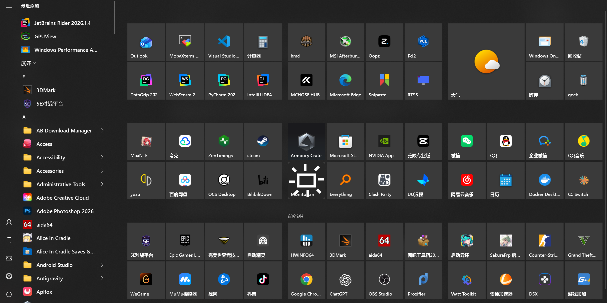

# TileStart

TileStart 是一个面向 Windows 10/11 x64 的 **Windows 10 风格磁贴开始菜单替代程序**。项目以真实 Windows 10 开始菜单的视觉和交互为参考，独立重写应用列表、磁贴分组、拖放重排和 Shell 接管能力，同时允许像启动器一样固定文件、文件夹、脚本、网址和自定义命令。

> [!IMPORTANT]
> TileStart 当前处于开发预览阶段，不是已发布的稳定系统组件。现阶段主要在 Windows 10 22H2 build 19045 上开发和实机验证；其他 Windows build 默认不启用未经验证的 Explorer Hook。



## 项目重点

- **Win10 体验优先**：不是通用现代启动器，而是针对 Windows 10 扩展开始菜单进行证据驱动的选择性重建。
- **任意目标固定**：除传统应用外，也可以组织文件、文件夹、脚本、网址和自定义命令。
- **系统接管可恢复**：Host、IPC、注入或版本检查失败时采用 fail-open，保留原版开始菜单可用性。
- **本地优先**：布局、窗口状态、磁贴设置、图标缓存和日志均保存在本机。

## 当前功能

- 单独 `Win` 键和任务栏开始按钮打开或关闭 TileStart。
- 保留 `Win+E/R/D/L/I/数字/方向键/Shift+S` 等系统组合键。
- 扫描用户和公共开始菜单，并显示 Win32、UWP/MSIX 应用。
- 最近添加、应用文件夹、字母索引和 Windows Search 转交。
- 8 单元磁贴网格，以及小、中、宽、大四种磁贴尺寸。
- Win10 风格磁贴组、组命名、二维组布局和整组拖动。
- 磁贴实时让位、跨组移动、创建文件夹、拆分新组和边缘自动滚动。
- 固定 `.exe`、`.lnk`、普通文件、文件夹、`.bat`、`.cmd`、`.ps1`、`.url` 与自定义命令。
- 自定义标题、副标题、颜色、背景图片、图标、图标大小和位置。
- 托盘暂停接管、打开原版开始菜单、切换登录自启动和退出。
- Explorer 重启后恢复接管；Host、IPC 或 Hook 不可用时放行原生行为。
- 本地 JSON 布局与窗口尺寸持久化。

## 已验证环境

首个持续对照环境：

```text
Windows 10 Pro for Workstations
22H2 build 19045 x64
2560 × 1600
150% DPI
240 Hz
任务栏位于底部
```

Windows 11 需要针对目标 build 建立独立适配器并完成实机验证，当前不能仅凭 Win10 结果视为已支持。

## 架构

```text
TileStart.Host.exe
├─ WPF 开始菜单界面
├─ 应用扫描、图标和启动
├─ 磁贴布局、设置与持久化
├─ 托盘和窗口生命周期
└─ Named Pipe Server

TileStart.ShellHook.dll
├─ Explorer 内的最小原生 Hook
├─ 开始按钮事件拦截
├─ Named Pipe Client
└─ IPC 不可用时 fail-open

TileStart.Injector.exe
├─ Hook 挂载与卸载
├─ Explorer 生命周期检测
└─ Windows build 兼容检查
```

Shell Hook 不加载 WPF、.NET 或业务配置；界面、扫描、设置和布局逻辑均运行在独立 Host 进程中。

## 构建

### 要求

- Windows 10/11 x64
- .NET SDK 8.0.408（由 `global.json` 固定）
- Visual Studio Build Tools / MSVC x64 工具链
- Inno Setup 6（仅打包安装程序时需要）

### 托管代码

```powershell
dotnet restore tests\TileStart.Host.Tests\TileStart.Host.Tests.csproj
dotnet build src\TileStart.Host\TileStart.Host.csproj -c Release
dotnet test tests\TileStart.Host.Tests\TileStart.Host.Tests.csproj -c Release
```

### 完整混合解决方案

需要在 Visual Studio Developer PowerShell 中运行：

```powershell
msbuild TileStart.sln /restore /m /p:Configuration=Release /p:Platform=x64
```

不要使用 `dotnet build TileStart.sln`，因为 .NET SDK MSBuild 不包含 Visual C++ targets。

### 本地打包

```powershell
.\scripts\Build-Package.ps1
```

输出：

```text
artifacts\package\TileStart-portable-win-x64.zip
artifacts\installer\TileStart-Setup-win-x64.exe
```

`artifacts/` 是本地构建输出，不提交到 Git。

## 使用

安装或解压后运行 `TileStart.Host.exe`。程序常驻通知区域，默认不显示主窗口。

- 点击任务栏开始按钮或单独按下 `Win`：打开或关闭 TileStart。
- 右键磁贴：取消固定、调整大小、管理员运行、打开文件位置或进入磁贴设置。
- 将文件或文件夹拖入磁贴区：创建磁贴。
- 拖动磁贴：组内重排、跨组移动、组成文件夹或拆分新组。
- 右键通知区域图标：暂停接管、打开原版开始菜单、切换登录自启动或退出。

配置、缓存与日志位于：

```text
%LOCALAPPDATA%\TileStart
```

## 项目结构

```text
src/TileStart.Host/          WPF Host、托盘、扫描、布局与配置
src/TileStart.ShellHook/     Explorer 原生 Hook
src/TileStart.Injector/      注入、版本检查和 Explorer 生命周期
src/TileStart.ShellProbe/    Shell/IPC 验证工具
tests/TileStart.Host.Tests/  托管单元与行为测试
installer/                   Inno Setup 安装配置
scripts/                     构建和打包脚本
tools/reverse/               可复现的 Win10 StartUI 研究工具
docs/                        验证记录、设计说明与逆向证据
```

## 独立重写与安全边界

生产运行时不会修改、托管或依赖微软 `StartUI.dll` 的内部实现。项目允许使用公开 PDB、二进制静态分析、XAML Diagnostics、WinDbg、ETW 和实机观察理解原版行为，但生产源码在 TileStart 中独立编写。

仓库不提交微软 DLL/PDB、系统 PRI、反编译数据库、Ghidra 工程或第三方逆向工具二进制；只保存版本哈希、符号锚点、行为观察、派生规格和自主实现。

Host 未运行、IPC 超时、注入失败或 Windows build 未验证时，不得阻断原版开始菜单。

## 文档

- [MVP 验证记录](docs/mvp-validation.md)
- [Win10 开始菜单研究记录](docs/win10-start-research.md)
- [Win10 Motion 逆向记录](docs/win10-start-motion-reverse.md)
- [可复现参考数据](docs/reference/win10-start/)

## 开发状态

TileStart 仍在持续校准 Win10 静态视觉、动画、磁贴交互和不同 DPI/显示器环境。构建成功或自动测试通过不等于系统级体验已经完成；涉及 Shell 接管、窗口生命周期、视觉、动画和性能的改动仍需在目标 Windows build 上实机验证。
