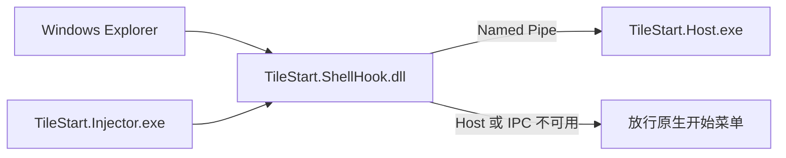

<div align="center">


# TileStart

**把 Windows 10 的磁贴开始菜单带回 Windows 10 / 11。**

[](https://github.com/Narylr350/TileStart/releases/latest)


[下载安装器](https://github.com/Narylr350/TileStart/releases/latest/download/TileStart-Setup-win-x64.exe) ·
[下载便携版](https://github.com/Narylr350/TileStart/releases/latest/download/TileStart-portable-win-x64.zip) ·
[查看最新发布](https://github.com/Narylr350/TileStart/releases/latest)

</div>

Windows 11 把磁贴开始菜单整个移除了。TileStart 在 Windows 10 / 11 x64 上重新实现了这套东西——应用列表、磁贴分组、拖放布局、Shell 接管，视觉和交互以真实的 Windows 10 扩展开始菜单为准。

> [!WARNING]
> 当前安装器和可执行文件尚未进行 Authenticode 代码签名，Windows Defender SmartScreen 可能显示"未知发布者"。请只从本仓库的 [Releases](https://github.com/Narylr350/TileStart/releases) 页面下载，并用随 Release 提供的 `SHA256SUMS.txt` 校验文件。

## 为什么做 TileStart

Windows 10 的磁贴开始菜单在 Windows 11 里消失了。习惯用分组磁贴管理常用程序的人，很难接受那排小图标作为替代。TileStart 最初就是为填这个缺口而写的。

除了把磁贴工作区搬回来，它也补上了原版长期没做好的几件事：把便携软件、普通文件、脚本和网址放进同一个开始菜单，让图标和背景真正能改，以及在 Shell 注入失败时不会把原生开始菜单也一并弄坏。配置全保存在本地，支持完整备份和跨机迁移。

## 功能

### 开始菜单与应用列表

- 单独按 `Win` 或点击任务栏开始按钮打开 / 关闭 TileStart。
- 保留 `Win+E/R/D/L/I/数字/方向键/Shift+S` 等系统组合键。
- 扫描用户与公共开始菜单，显示 Win32、UWP/MSIX 应用。
- TileStart 长期驻留时会在菜单显示后后台重扫，新安装的软件无需重启即可出现在应用列表中。
- 最近添加、应用文件夹、字母索引和应用列表内搜索。
- 便携应用可加入应用列表，并提供单独的取消固定操作。
- Explorer 重启后自动恢复接管。

### 磁贴工作区

- Win10 风格磁贴组、组命名和二维组布局。
- 小 `1×1`、中 `2×2`、宽 `4×2`、大 `4×4` 四种磁贴尺寸。
- 组内重排、跨组移动、自动让位、边缘滚动和整组拖动。
- 把磁贴组成文件夹，管理文件夹内容，或从现有组拆分为新组。折叠预览、展开过渡和内容布局按 Win10 实机行为重建，预览磁贴会连续移动到展开后的对应位置。
- 支持固定 `.exe`、`.lnk`、普通文件、文件夹、批处理、PowerShell、URL、UWP/MSIX 与自定义命令，可设置启动参数、工作目录和管理员运行。
- 可从资源管理器直接拖入内容，也可通过盘符右键菜单将本地磁盘或可移动磁盘固定到 TileStart。

### AI 辅助布局管理

仓库内置 [`scripts\Manage-Layout.ps1`](scripts/Manage-Layout.ps1)，供 AI 或本地自动化安全读取和调整开始菜单布局：

- `Paths` 输出权威布局文件与本机偏好文件路径。
- `Summary` 生成精简但保留完整磁贴 ID、目标和坐标的 AI 可读摘要。
- `Validate` 在写入前检查版本、重复 ID、越界、磁贴重叠、组重叠和非法嵌套文件夹。
- `Apply` 先校验候选布局，再备份当前布局、正常停止 Host、原子替换文件并恢复同一个 Host。

```powershell
powershell -ExecutionPolicy Bypass -File scripts\Manage-Layout.ps1 -Action Summary -OutputPath "$env:TEMP\TileStart-layout-summary.json"
powershell -ExecutionPolicy Bypass -File scripts\Manage-Layout.ps1 -Action Validate -InputPath "$env:TEMP\layout-candidate.json"
powershell -ExecutionPolicy Bypass -File scripts\Manage-Layout.ps1 -Action Apply -InputPath "$env:TEMP\layout-candidate.json"
```

详细说明和可选的本机 AI 整理偏好见 [AI 辅助布局管理](docs/ai-layout-management.md)。TileStart 不会把个人分类、排序或收纳规则当成产品默认值。

### 图标与外观

- 使用应用默认图标、程序资源或本地图片，支持 PNG、JPEG、BMP、ICO、GIF、SVG，也可主动下载网络图标。
- 静态图片与 GIF 可作为磁贴背景。
- 界面风格和颜色模式分别设置：Windows 10 / 11 风格，随系统 / 浅色 / 深色模式；两种风格共享 Win10 主布局，Win11 主题只更换字体、材质、颜色、描边和圆角。
- Win10 主题按 Windows 10 22H2 原版开始菜单校准应用列表、导航层、磁贴材质、文件夹、右键菜单与 Light / Dark 状态；Win11 主题在同一布局上使用 4 DIP 磁贴圆角、Subtle Fill、Popup Acrylic、对话框 Mica 和现代窗口过渡。
- 自定义背景色、文字色、图标大小与位置、标题显示、六种标题位置和背景缩放；旧布局默认保持 Win10 风格的左下标题。
- 磁贴设置窗口有实时预览，支持一键恢复默认外观，以及"应用"和"保存并关闭"两种提交方式。
- 文件夹设置只显示实际生效的名称、标题、颜色、背景和内容管理能力，不再暴露无效的父磁贴图标或启动选项。

### 备份与恢复

从通知区域右键 TileStart 图标，选择 **"备份与恢复…"**：

- 一键创建完整 `.tilestartbackup` 备份，可分类选择只恢复磁贴布局、应用列表、隐藏状态、窗口偏好、图标资源或任务栏快捷方式。
- 自动收集外部本地图标、GIF 与背景图片，换电脑迁移时不需要单独处理图片资源。
- 恢复前自动创建当前状态的安全快照；日志和旧备份不会被递归打包进去。
- 对恢复归档执行路径、文件数量和体积检查。

### 托盘与系统集成

- 暂停 / 恢复 Shell 接管，或主动打开原生开始菜单。
- 切换登录自启动。
- 资源管理器右键"添加到 TileStart 应用列表"或"添加到 TileStart 磁贴区"。
- 设置二级页面支持返回上一级；"关于项目"中可主动检查 GitHub 最新 Release。
- 可从设置页导出包含系统信息、版本和运行日志的诊断包，用于兼容问题反馈。
- 更新包下载后必须通过 SHA-256 校验；安装版启动安装器，便携版打开下载目录供手动覆盖。
- Host、IPC 或 Hook 不可用时采用 fail-open，放行原生行为。

## 下载与安装

最新版本请以 [Releases 页面标记的 Latest](https://github.com/Narylr350/TileStart/releases/latest) 为准，避免 README 中的固定版本号在新版本发布后过期。

| 文件 | 用途 |
| --- | --- |
| [`TileStart-Setup-win-x64.exe`](https://github.com/Narylr350/TileStart/releases/latest/download/TileStart-Setup-win-x64.exe) | 推荐。管理员安装，默认进入 `C:\Program Files\TileStart`，向导可修改目录 |
| [`TileStart-portable-win-x64.zip`](https://github.com/Narylr350/TileStart/releases/latest/download/TileStart-portable-win-x64.zip) | Self-contained 便携版，无需另装 .NET 运行时 |
| [`SHA256SUMS.txt`](https://github.com/Narylr350/TileStart/releases/latest/download/SHA256SUMS.txt) | Release 附件的 SHA-256 校验值 |

### 安装版

1. 从 Releases 下载 `TileStart-Setup-win-x64.exe`。
2. 运行安装器并通过 UAC 确认。
3. 按需修改安装目录、登录自启动和桌面快捷方式选项。
4. 安装后运行 TileStart；程序会常驻通知区域。

升级时直接运行新版本安装器即可。卸载会删除程序文件、Shell 右键菜单和安装器创建的自启动项，但 `%LOCALAPPDATA%\TileStart` 中的用户配置会保留。

### 便携版

1. 解压 `TileStart-portable-win-x64.zip` 到普通可写目录。
2. 运行 `TileStart.Host.exe`。
3. 不要只复制 Host；`TileStart.Injector.exe` 与 `TileStart.ShellHook.dll` 必须留在同一目录。

## 快速使用

- **打开菜单**：按一次 `Win`，或点击任务栏开始按钮。
- **固定应用**：在左侧应用列表右键应用，添加到磁贴区域。
- **固定便携软件**：在资源管理器右键 `.exe` / `.lnk`，添加到应用列表或磁贴区域。
- **固定任意项目**：将文件、文件夹、脚本或网址拖入磁贴区。
- **调整布局**：拖动磁贴或磁贴组；把磁贴拖到另一块上可组成文件夹。
- **自定义磁贴**：右键磁贴打开设置。
- **恢复原版**：右键通知区域图标，暂停接管或直接打开原生开始菜单。
- **备份配置**：右键通知区域图标，打开备份与恢复。

## 数据位置

TileStart 的用户数据保存在：

```text
%LOCALAPPDATA%\TileStart
```

主要内容：

```text
layout.json          磁贴与分组布局
ai-layout-preferences.json  可选的本机 AI 布局整理偏好
custom-apps.json     手动添加的应用
hidden-apps.json     应用隐藏状态
window.json          窗口尺寸
navigation.json      导航偏好
icons\               网络、SVG 与恢复后的受管图标
backups\             恢复前自动创建的安全快照
TileStart.log        本地诊断日志
ShellHook.log        Explorer Hook 诊断日志
```

## 兼容性

TileStart 面向 Windows 10 / 11 x64。当前主动开发和日常回归在 Windows 11 上进行，同时保留 Windows 10 22H2 虚拟机用于 Win10 主题、Light / Dark、布局边界和安装包回归。两个平台使用独立 Shell 适配器族，视觉验收也分别记录。

### 当前 Windows 11 验证环境

```text
Windows 11 25H2 build 26200.8875 x64
2560 × 1600 / 150% DPI / 240 Hz
任务栏位于底部、左对齐
```

该环境已验证 Win11-modern 适配器选择、ShellHook 注入、单独 `Win` 键、磁贴拖动、文件夹展开动画和不同磁贴区列数。应用扫描已与菜单显示路径完全解耦，不再在按 Win 时执行目录或 `AppsFolder` 全量枚举。

### Windows 10 回归环境

```text
Windows 10 Pro for Workstations
22H2 build 19045 x64
2560 × 1600 / 150% DPI / 240 Hz
任务栏位于底部
```

Windows 10 build 19045 已用于开始按钮、单独 `Win` 键、磁贴布局、150% DPI、底部任务栏以及 Win10 Light / Dark 主界面的回归。Win10 与 Win11 使用独立适配路径，不能用其中一个平台的结果替代另一个平台。

Shell 接管与 Windows build 强相关。build 号只用于选择最接近的适配器族，不是精确白名单；未知或未来 build 会先尝试兼容路径，并在日志中记录实际 build 与适配器选择。Host、Injector、Hook 或 IPC 不可用时必须放行原生开始菜单。

## 已知问题与限制

- 安装器和可执行文件尚未进行 Authenticode 代码签名。
- 未记录或未来的 Windows build 会尝试兼容路径，但在对应实机验证前不能视为已确认兼容。
- 任务栏开始按钮接管和 Explorer 重启后自动恢复曾在 Windows 11 build 22631 验证，当前 build 26200 尚未完成同等范围的正式回归。
- 非底部任务栏、任务栏自动隐藏、多显示器混合 DPI 和全屏游戏中的单独 `Win` 键仍需要扩大实机覆盖。
- 传统 Win32 安装程序创建开始菜单快捷方式后可由目录监听及时刷新；纯 UWP/MSIX 安装、更新或卸载依赖独立的低频后台兜底扫描，应用列表最多可能延迟约 5 分钟更新。
- Win10 虚拟机可以覆盖安装、主题和常规桌面交互，但任务栏位置、多显示器、混合 DPI、触摸和全屏游戏等环境仍需独立扩大实机覆盖。
- 当前直接输入会打开 TileStart 自己的应用列表搜索框并原地过滤应用，尚未按目标行为转交 Windows Search；All Apps 的字母 type-to-jump 也尚未补齐。
- 当前不提供后台自动更新、云同步、插件市场或视频背景；更新检查仅在用户从托盘主动触发时联网。

## 问题反馈与诊断

请通过 [GitHub Issues](https://github.com/Narylr350/TileStart/issues/new/choose) 提交问题。Bug 表单会要求 TileStart 版本、完整 Windows build、其他 Shell 增强软件、复现步骤以及预期和实际结果。

在 **设置 → 维护与信息 → 诊断日志** 中可以导出 `TileStart-diagnostics-*.zip`，包含：

- `system-info.txt`：TileStart 版本、Windows 版本/build 和进程架构。
- `TileStart.log`：Host 启动、Injector 适配器选择、注入结果和托管异常。
- `ShellHook.log`：开始按钮、Win 键、IPC 与 fail-open 路径记录。
- `README.txt`：诊断包内容和隐私提醒。

诊断包不包含磁贴布局、图标或备份，但日志仍可能出现本地文件路径和应用名称，公开上传前请先检查内容。若 `TileStart.Host.exe` 或 `explorer.exe` 崩溃，可额外附上 `%LOCALAPPDATA%\CrashDumps` 中的 `.dmp`，或使用 Windows 11 任务管理器的"创建实时内存转储文件"；转储可能包含敏感内存内容，不建议未经检查公开上传。

## 安全与故障回退

TileStart 把系统接管限制在最小原生组件内：


```mermaid
flowchart LR
    Explorer[Windows Explorer] --> Hook[TileStart.ShellHook.dll]
    Hook -->|Named Pipe| Host[TileStart.Host.exe]
    Injector[TileStart.Injector.exe] --> Hook
    Hook -->|Host 或 IPC 不可用| Native[放行原生开始菜单]
```

- `TileStart.ShellHook.dll` 不加载 WPF、.NET 或业务配置。
- 应用扫描、窗口、磁贴布局和设置都运行在独立 Host 进程。
- Injector 负责 Explorer 生命周期与 Hook 挂载 / 卸载。
- Host 崩溃、IPC 超时或 Hook 安装/运行失败时，不应阻断原生行为。
- 卸载时会停止 Host / Injector，并清理安装器注册的 Shell 项。

## 从源码构建

### 环境要求

- Windows 10 / 11 x64
- [.NET SDK 8](https://dotnet.microsoft.com/download/dotnet/8.0)（`global.json` 固定 `8.0.408`，允许滚动到最新补丁）
- Visual Studio 或 Build Tools，包含 MSBuild 与 MSVC x64 工具链
- Inno Setup 6（仅生成安装程序时需要）

### 托管代码与测试

```powershell
dotnet restore tests\TileStart.Host.Tests\TileStart.Host.Tests.csproj
dotnet build src\TileStart.Host\TileStart.Host.csproj -c Release
dotnet test tests\TileStart.Host.Tests\TileStart.Host.Tests.csproj -c Release
```

### 完整混合解决方案

从 Visual Studio Developer PowerShell 运行：

```powershell
msbuild TileStart.sln /restore /m /p:Configuration=Release /p:Platform=x64
```

不要使用 `dotnet build TileStart.sln`：.NET SDK MSBuild 不包含 Visual C++ targets。

### 生成便携包与安装器

```powershell
.\scripts\Build-Package.ps1
```

输出：

```text
artifacts\package\TileStart-portable-win-x64.zip
artifacts\installer\TileStart-Setup-win-x64.exe
```

只生成便携包：

```powershell
.\scripts\Build-Package.ps1 -SkipInstaller
```

`artifacts/` 是本地构建输出，不提交到 Git。

## 项目结构

```text
src/TileStart.Host/          WPF Host、应用扫描、磁贴、设置、备份与托盘
src/TileStart.ShellHook/     Explorer 内的最小原生 Hook
src/TileStart.Injector/      Hook 挂载、兼容适配与 Explorer 生命周期
src/TileStart.ShellProbe/    Shell / IPC 验证工具
tests/TileStart.Host.Tests/  托管单元、行为与 XAML 回归测试
installer/                   Inno Setup 安装配置
scripts/                     构建、打包与 AI 辅助布局管理脚本
docs/                        公共设计、验证和使用说明
```

## 参与开发

欢迎通过 Issues 或 Pull Requests 提交可复现的问题、Windows build 信息、性能采样和改进建议。涉及 Shell 接管、动画、视觉或不同 DPI 的变更，请同时说明 Windows build、DPI、任务栏位置和验证方式。

## 许可证

TileStart 使用 [Apache License 2.0](LICENSE)，允许个人和商业使用、修改与再发布，但必须保留许可证和版权声明，并遵守 Apache-2.0 的专利与署名条款。项目版权声明见 [NOTICE](NOTICE)。
