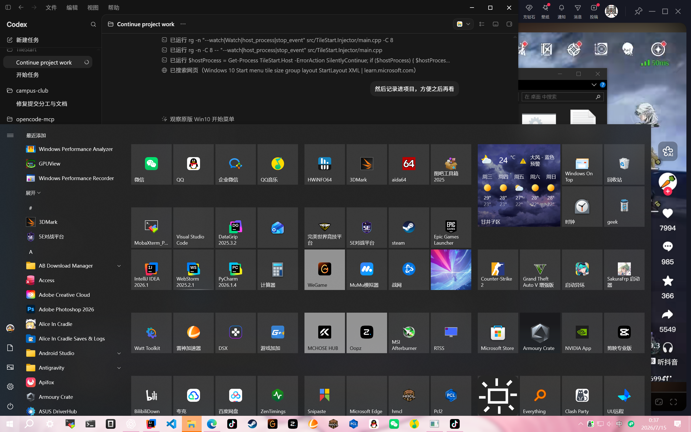

# Windows 10 开始菜单还原研究

> 目标环境：Windows 10 Pro for Workstations 22H2，build 19045，2560×1600，150% DPI，底部任务栏。
>
> 本文是 TileStart 后续 UI 和交互实现的参考基线。实现时优先相信实机截图、导出的原生布局和重复实测，不凭印象调整。

## 1. 产品目标

TileStart 的目标不是通用启动器，而是：

1. 默认外观和操作尽量复刻 Windows 10 19045 开始菜单。
2. 保留 Win10 的应用列表、磁贴分组、拖动、缩放、焦点和关闭习惯。
3. 在原版磁贴外壳内扩展内容能力，支持任意文件、文件夹、脚本、网址、自定义命令、图标、文字、颜色、图片和后续动态内容。
4. 自定义能力不能改变默认 Win10 手感；高级能力应通过磁贴设置进入，而不是把主界面改成现代启动器或仪表盘。

## 2. 证据等级

- **实机已观察**：来自当前 Win10 19045 截图、导出布局或直接操作。
- **微软资料**：来自 Microsoft Learn 对 Windows 10 Start layout 的说明。
- **待实测**：尚未完成逐帧、键盘、触摸或边界条件验证，不能当作最终参数。

## 3. 已保存的原始证据

- `reference/win10-start/native-start-overview-2560x1600-150pct.png`
  - 当前机器原版开始菜单总览。
  - 物理分辨率 2560×1600，缩放 150%。
- `reference/win10-start/native-layout.xml`
  - 使用 `Export-StartLayout -UseDesktopApplicationID` 导出的当前原生布局。
  - 保留真实分组顺序、磁贴尺寸、行列位置、AUMID、DesktopApplicationID 和 SecondaryTile 信息。
- `startui-layout-symbols.md`
  - 当前 `StartUI.dll`、匹配公开 PDB、Ghidra 符号和布局解析器委托边界。
  - 记录可追溯的常量、公式、函数地址和仍未确认的问题。
- `win10-start-motion-reverse.md`
  - 记录全局进入、退出、应用启动、视图切换和拖动 reflow 的直接反编译证据。
  - 包含逐元素 Z/Y 轴位移、透明度、错峰延迟、持续时间、KeySpline 和调用链。



## 4. 当前系统实现信息

- Start Host 包：`Microsoft.Windows.StartMenuExperienceHost`
- 包版本：`10.0.19041.5438`
- 安装位置：`C:\Windows\SystemApps\Microsoft.Windows.StartMenuExperienceHost_cw5n1h2txyewy`
- 当前布局使用 `StartTileGroupCellWidth="8"` 和 `GroupCellWidth="8"`。
- 导出 XML 中可见的磁贴类型：
  - `start:DesktopApplicationTile`
  - `start:Tile`（UWP/MSIX）
  - `start:SecondaryTile`

## 5. 实机几何测量

以下数值来自总览截图的初步像素测量。实现像素锁定前应再用脚本重复检测边界。

| 项目 | 物理像素（150%） | 约合 DIP | 说明 |
|---|---:|---:|---|
| 屏幕 | 2560×1600 | 1706.7×1066.7 | 当前首个验证环境 |
| 任务栏顶部 | Y=1512 | 1008 | 开始菜单不覆盖任务栏 |
| 开始菜单顶部 | Y≈359 | 239.3 | 当前用户调整后的高度 |
| 开始菜单右边界 | X≈1878 | 1252 | 当前用户调整后的宽度 |
| 开始菜单高度 | ≈1153 | 768.7 | 底部锚定 |
| 应用/磁贴分界 | X≈378 | 252 | 左栏总宽度约 252 DIP |
| 中磁贴 | 150×150 | 100×100 | 与现有 `2×2` 模型吻合 |
| 磁贴间隙 | ≈6 | 4 | 横纵统一 |

### 5.1 磁贴网格

原生布局使用 8 个逻辑单元宽的分组：

| 原生 XML Size | 逻辑跨度 | 目标 DIP |
|---|---:|---:|
| `1x1` | 1×1 | 48×48 |
| `2x2` | 2×2 | 100×100 |
| `4x2` | 4×2 | 204×100 |
| `4x4` | 4×4 | 204×204 |

基础单元 48 DIP，间隙 4 DIP，步长 52 DIP。8 单元分组内容宽度为 412 DIP；实现时需要再测量组间距和标题预留区域。

### 5.2 分组排布

**实机已观察：**

- 每个分组内部是 8 单元宽网格。
- 多个分组不是无限水平单行，而是在可用磁贴区域内横向排列并自动换到下一行。
- 分组高度由其内部最高占用行决定。
- 空名称分组仍保持组级间距和布局边界。
- 当前 TileStart 使用横向 `StackPanel`，不具备原版分组换行行为，是必须重做的结构问题。

## 6. 主界面结构

### 6.1 窗口

**实机已观察：**

- 左下角锚定，底边贴合任务栏工作区顶部。
- 不覆盖任务栏。
- 无普通窗口标题栏和系统边框。
- 背景是深色半透明/模糊材质，不是单一不透明灰色。
- 宽度和高度可由顶部、右侧和右上区域调整。
- 当前用户把菜单扩展到较宽、较高状态；窗口恢复时应保持该状态。

**待实测：**

- 宽度是否按列或分组步进吸附。
- 拖拽调整时最小/最大宽高。
- 动画时长、缓动曲线和窗口裁剪方式。
- 多显示器、不同 DPI 和任务栏其他边缘的精确定位。

### 6.2 左侧导航轨

**实机已观察：**

- 最左侧是窄导航轨。
- 顶部为汉堡按钮。
- 底部依次放置用户/文档/图片/设置/电源等入口，具体入口受系统配置影响。
- 图标使用 Segoe MDL2 Assets 风格。
- 导航轨与应用列表属于同一开始菜单表面，没有额外卡片或描边。

**待实测：**

- 汉堡按钮点击和悬停展开方式。
- 展开后是覆盖应用列表还是推动内容。
- 标签出现/消失动画和焦点规则。

### 6.3 应用列表

**实机已观察：**

- 顶部显示“最近添加”。
- 最近添加下方显示少量应用，之后有“展开”。
- 全部应用按 `#`、A-Z 分段。
- 行高紧凑，图标左置，名称单行显示。
- 文件夹型开始菜单目录显示折叠箭头。
- 应用列表独立垂直滚动。
- 背景、悬停和按下状态都很克制，不使用圆角卡片。

**必须补测：**

- 点击字母标题后的字母索引面板。
- 文件夹展开/折叠动画和缩进。
- 最近添加的展开、折叠和最大数量。
- 鼠标滚轮、触控板和键盘滚动。

### 6.4 磁贴区

**实机已观察：**

- 中磁贴默认约 100×100 DIP。
- 默认静态磁贴背景接近深灰，磁贴之间为 4 DIP 缝隙。
- 图标位于主体区域中央，名称位于左下方。
- 名称使用白色或根据磁贴前景策略切换深色。
- 支持 UWP Live Tile、自定义 SecondaryTile 图片和颜色。
- 分组在宽度不足时换行，而不是依赖底部横向滚动条。
- 原版允许同一分组内混合不同尺寸。

## 7. 原版行为矩阵

| 场景 | 目标行为 | 证据状态 |
|---|---|---|
| 单独按 `Win` | 打开；再次按下关闭 | 项目既有实测要求 |
| 点击开始按钮 | 打开且原版菜单不闪现 | 项目既有实测要求 |
| 点击菜单外部 | 关闭并恢复原窗口焦点 | 待逐项复测 |
| `Esc` | 关闭当前层级；搜索/菜单层级应分别处理 | 待逐项复测 |
| 直接输入文字 | 从开始菜单自然进入搜索，不要求先点搜索框 | 原版常规行为，待记录截图 |
| `Ctrl+F` | 不应成为主要原版路径 | TileStart 当前自定义行为，需降级 |
| 方向键 | 在应用列表、磁贴和菜单项间移动焦点 | 待键盘矩阵测试 |
| `Tab` / `Shift+Tab` | 在导航轨、应用列表、磁贴区间切换 | 待键盘矩阵测试 |
| 鼠标悬停磁贴 | 轻微提亮，无圆角卡片化 | 实机截图 + 待录制 |
| 鼠标按下磁贴 | 原版按压反馈后启动 | 待逐帧录制 |
| 右键磁贴 | 显示 Win10 风格上下文菜单；包含取消固定、调整大小、更多 | 微软资料 + 待截图 |
| 拖动磁贴 | 磁贴抬起，其他磁贴实时让位 | 微软资料 + 待录制 |
| 拖到空白区 | 创建或移动到新分组 | 微软资料 |
| 点击组名区域 | 出现可编辑的“命名组”输入 | 微软资料 + 待截图 |
| 调整窗口大小 | 左下锚定，顶部/右侧变化，分组重新换行 | 实机已观察部分 |
| 启动应用 | 菜单关闭，焦点交给目标 | 待按目标类型验证 |
| Explorer 重启 | 接管恢复；失败时原版可用 | 项目硬约束 |

## 8. 微软资料确认的能力

Microsoft Learn 对 Windows 10 Start layout 的说明确认：

- 可以固定和取消固定应用。
- 可以拖动磁贴重排或分组。
- 可以通过右键菜单调整磁贴大小。
- 可以把磁贴拖到空白区域创建分组。
- 可以点击分组上方的名称区域编辑组名。
- 可以使用 `Export-StartLayout` 导出 XML。
- Windows 10 布局模型区分桌面应用、UWP 应用和 SecondaryTile。

参考资料：

- <https://learn.microsoft.com/en-us/windows/configuration/start/layout>
- <https://learn.microsoft.com/en-us/windows/configuration/start/start-layout-xml-desktop>

## 9. TileStart 当前主要偏差

### P0：结构性偏差

1. 磁贴分组使用水平 `StackPanel`，原版是可换行的分组布局。
2. 当前窗口初始宽度和内容密度没有以实机截图为基准。
3. 左侧导航轨、应用列表和磁贴区的比例、留白、滚动模型不够接近原版。
4. 原版没有“现代卡片式”主按钮；“添加磁贴”不应长期占据主界面顶部。
5. 设置窗口是普通 WPF 表单，和 Win10 上下文菜单/设置体验不一致。
6. 原版材质、阴影、边界、字体层级、悬停和按压反馈尚未还原。

### P1：交互偏差

1. 搜索目前依赖显式搜索面板和 `Ctrl+F`，应改为原版直接输入行为。
2. 拖动目前只在落下后规范化，没有原版实时让位动画和插入预览。
3. 缺少组名编辑、创建组、跨组视觉反馈和分组换行。
4. 缺少字母索引面板和应用文件夹展开行为。
5. 缺少完整键盘焦点和可访问性导航。
6. 上下文菜单不是 Win10 风格，也没有分层的“调整大小”和“更多”。

### P2：自定义磁贴内容

在保留原版默认外壳的基础上扩展：

- 背景：纯色、强调色、图片、渐变。
- 图标：Shell 图标、自定义图片、图标位置和缩放。
- 文本：标题、副标题、角标，保留原版默认左下标题。
- 内容模板：静态应用、文件、命令、图片、状态文本、进度、快捷操作。
- 启动：目标、参数、工作目录、管理员运行。
- 尺寸：严格使用原版四种网格尺寸。
- 动态内容默认关闭，不读取原生 Live Tile 私有数据；由 TileStart 自己的数据源驱动。

自定义功能应通过右键菜单中的 TileStart 专属入口进入。原版菜单项和 TileStart 扩展项需要视觉分组，避免破坏原版认知。

## 10. 重做顺序

### 阶段 A：静态像素还原

1. 用实机截图重建窗口、左轨、应用列表和磁贴区比例。
2. 建立 Win10 设计令牌：颜色、透明度、字体、字号、行高、间距、图标尺寸。
3. 将磁贴分组容器改为支持横向排列和自动换行的布局。
4. 移除主界面中不属于 Win10 的按钮和卡片感。
5. 逐 DPI 生成对照截图并做像素差异检查。

### 阶段 B：原版交互

1. 直接输入搜索和搜索退出逻辑。
2. 导航轨展开、字母索引、应用文件夹。
3. Win10 风格磁贴上下文菜单。
4. 实时拖动占位、让位动画、跨组和新组创建。
5. 组名编辑、窗口缩放重排、键盘焦点矩阵。

### 阶段 C：TileStart 扩展

1. 在原版上下文菜单中加入“TileStart 设置”。
2. 自定义背景、图标和文字模板。
3. 任意文件/命令启动配置。
4. 可选动态磁贴内容。

## 11. 后续观察清单

后续每完成一项都应保存截图或录屏，并在本文标记为“实机已观察”：

- [ ] 左导航轨折叠/展开
- [ ] 字母索引面板
- [ ] 直接输入搜索全过程
- [ ] 应用文件夹展开
- [ ] 磁贴右键菜单的全部层级
- [ ] 四种磁贴尺寸实际外观
- [ ] 组名编辑
- [ ] 同组拖动实时让位
- [ ] 跨组拖动
- [ ] 拖到空白区创建新组
- [ ] 顶部、右侧、右上缩放
- [ ] 最小/最大尺寸
- [ ] 菜单打开和关闭动画
- [ ] 100%、125%、150%、175%、200% DPI
- [ ] 多显示器和不同任务栏位置

## 12. 原版二进制静态分析

2026-07-15 对当前系统组件进行了只读静态检查，结果保存于 `reference/win10-start/startui-static-analysis.json`。

### 12.1 组件边界

当前包中与开始菜单主体直接相关的文件很少：

- `StartMenuExperienceHost.exe`：宿主进程。
- `StartUI.dll`：Win10 开始菜单的主要 C++/CX + Windows.UI.Xaml 实现。
- `resources.pri` 与语言 PRI：资源索引。
- `AppxManifest.xml`：包身份、受限能力和 WinRT 激活类注册。

`StartUI.dll` 只导出：

- `DllCanUnloadNow`
- `DllGetActivationFactory`

这说明它不是一个可直接调用的普通控件 DLL，而是通过 WinRT 激活工厂提供 `StartUI.*` 类型。包清单明确注册了以下可用于定位真实视觉树和模型的类：

- `StartUI.StartSizingFrame`
- `StartUI.SplitViewFrame`
- `StartUI.NavigationPaneView`
- `StartUI.AllAppsPane`
- `StartUI.TileGridView`
- `StartUI.TileGroupViewControl`
- `StartUI.TileViewControl`
- `StartUI.TileListView`
- `StartUI.TileMetrics`
- `StartUI.GridMetrics`
- `StartUI.StartModel`
- `StartUI.StartProperties`
- `StartUI.HostSpecificTestHooks`

二进制字符串还保留了大量源文件路径、类型名、资源键和 ETW 事件名，例如：

- `StartSizingFrame.xaml.cpp`
- `AllAppsPane.xaml.cpp`
- `TileDragDropRearrangeEngine`
- `KeyboardTileRearrangeEngine`
- `TileGroupViewModel`
- `ThemeAwareBackgroundColorOverlayAccentAcrylicBrush`
- `StartUnifiedTileModelCache.dat`

因此，**对原版进行类级、视觉树级和行为级逆向是可行的**，不需要只靠截图猜。

### 12.2 为什么不能把 `StartUI.dll` 简单塞进 TileStart

`StartUI.dll` 同时依赖：

- `wincorlib.dll` 和 Windows.UI.Xaml 的 C++/CX 激活环境；
- `StartTileData.dll` 及内部 Start Layout COM 类；
- `cloudStore`、`shellexperience`、`visualElementsSystem` 等系统包能力；
- `Microsoft.Windows.StartMenuExperienceHost` 的包身份、生命周期和 Immersive Shell 服务；
- 私有 WinRT 接口、系统状态和当前 Windows build 的二进制契约。

所以独立 WPF 进程直接 `LoadLibrary(StartUI.dll)` 并创建完整菜单并不是简单路线。已有成功项目也不是这样做的；它们让原 DLL 继续运行在系统宿主环境中，再进行激活重定向、注入和 Hook。

## 13. GitHub 现有实现调查

调查时固定到下列仓库及 2026-07-15 取得的 HEAD，后续引用代码前仍需重新核验上游变化。

### 13.1 ExplorerPatcher：证明“复用原版 Win10 StartUI”可行

- 仓库：<https://github.com/valinet/ExplorerPatcher>
- 调查提交：`0a88a6e0ef6b1752fea36e581cffff1097e862b0`
- 许可证：GPL-2.0。
- 关键文件：
  - `ep_startmenu/ep_sm_main.c`
  - `ep_startmenu/ep_sm_main_cpp.cpp`
  - `ExplorerPatcher/StartMenu.c`
  - `ExplorerPatcher/TwinUIPatches.cpp`
  - `ExplorerPatcher/lvt.c`
  - `ExplorerPatcher/symbols.c`
  - `ExplorerPatcher/symbols.h`
  - `ep_gui/resources/settings.reg`

代码证据表明 ExplorerPatcher 的 Win10 开始菜单不是重新画了一套，而是复用系统中仍存在的 `StartUI.dll`：

1. 检查 `StartUI.dll` / `StartUI_.dll` 和 `StartTileData` 布局工厂是否存在。
2. 使用 `Start_ShowClassicMode` 选择 Win10 菜单。
3. 在 Win11 已删除原切换逻辑的 build 上，把 `StartDocked.App` 的激活重定向到 `StartUI.App`。
4. 把 `StartDocked` 的 XAML metadata provider 重定向到 `StartUI.startui_XamlTypeInfo.XamlMetaDataProvider`。
5. 通过 `DllGetActivationFactory` 激活原版 `StartUI.*` 类。
6. 使用 Microsoft 符号、函数偏移、模式匹配和 Hook 修复动画、定位、常用应用数等 build 差异。
7. 直接遍历 Windows.UI.Xaml Visual Tree，按类名找到 `StartUI.StartSizingFrame` 等节点，并修改阴影、圆角、padding 等属性。
8. 通过私有 `IImmersiveLauncher` / `IImmersiveMonitorService` 控制显示、关闭和目标显示器。

这给 TileStart 两个直接结论：

- **原版外壳可以注入和改动，技术上已经被证明。**
- 这种路线依赖系统私有 ABI、符号和逐 build 补丁，不是“复制几段 XAML”即可完成。

许可证上，ExplorerPatcher 的 GPL-2.0 代码不能在未接受相应分发义务时直接复制进 TileStart。接口名、观察结论和独立实现可以作为研究线索；若复用代码，必须单独做许可证决策。

### 13.2 TileIconifier：普通桌面快捷方式的原生磁贴资产

- 仓库：<https://github.com/Jonno12345/TileIconifier>
- 调查提交：`84fa35fd24ae3689c85f0a714c33e0dc5dc76369`
- 许可证：MIT。

其做法是为目标程序生成 `*.VisualElementsManifest.xml` 和 PNG，随后触碰开始菜单 `.lnk` 的修改时间让 Shell 重建视觉资源。可借鉴：

- EXE/DLL 图标提取；
- 图标缩放和定位；
- 中、小磁贴 PNG 生成；
- manifest 备份与恢复；
- 自定义快捷方式生成。

它也明确验证了原生限制：普通 `.lnk + VisualElementsManifest` 只能覆盖 Small/Medium；Wide/Large 和动态内容需要 Live Tile / SecondaryTile 路线。

### 13.3 OhMyTile：原生 SecondaryTile 和动态内容能力

- 仓库：<https://github.com/EnumaZannen/OhMyTile>
- 调查提交：`c557ded95c93bac8f0cef33495a4f913e4445f21`
- 调查时仓库未发现许可证文件，**不能直接复制其代码**。

源码证明桌面 WPF + MSIX/松散包身份可以：

- 创建 `SecondaryTile`；
- 设置 Square/Wide 图像、标题、前景色和背景色；
- 用 `RequestCreateAsync()` 让用户固定到原生开始菜单；
- 用 `TileUpdateManager`、Tile XML 和计划通知轮换图片；
- 把一张大图切割为多个原生磁贴。

这条路线非常适合验证和借鉴“自定义磁贴内容协议”，但它仍受原生 Tile 模板、通知队列和系统冻结策略限制，不能在原版磁贴里嵌入任意 WPF 控件或无限交互逻辑。

### 13.4 Startify：可参考但不能作为复刻基底

- 仓库：<https://github.com/PSGitHubUser1/Startify>
- 调查提交：`fc1a84eb6031c88e6fd908ea823f6adcedb4a025`
- 许可证：MIT。
- 最后提交时间：2023-11-27。

项目 README 自称 unfinished prototype。布局主要使用固定 Tile 控件和 `ItemsWrapGrid MaximumRowsOrColumns="3"`，没有完整复现 Win10 的 8 单元可变尺寸分组、自动换行和系统级交互。可以参考应用扫描、窗口接管和 WinUI/WPF 分层，但不应以它的 UI 作为精度基线。

### 13.5 Open-Shell

- 仓库：<https://github.com/Open-Shell/Open-Shell-Menu>

其重点是经典开始菜单，不复刻 Win10 磁贴界面。Shell 集成、搜索和菜单基础设施有参考价值，视觉和磁贴模型不适合作为 TileStart 主路线。

## 14. “直接逆向原版”可选路线

| 路线 | 原版还原度 | 自定义内容 | 维护成本 | 结论 |
|---|---:|---:|---:|---|
| A. 黑盒测量后自行重建 WPF UI | 高，可逐项逼近 | 最高 | 中 | 最稳定的产品路线 |
| B. 注入原版 `StartMenuExperienceHost`，修改 Visual Tree | 原生 | 低到中 | 很高 | 可做研究和少量外观补丁 |
| C. Hook 原版 Tile ViewModel / DataCollection，注入假磁贴 | 原生 | 中 | 极高 | 可做实验，不宜直接承诺产品化 |
| D. 使用 `SecondaryTile` / Live Tile 协议扩展原版 | 原生 | 中，受模板限制 | 中 | Win10 上最简单的原生扩展路线 |
| E. 独立进程直接托管 `StartUI.dll` | 理论上原生 | 未知 | 极高 | 没有现成简单实现，不作为首选 |

### 14.1 最值得做的原版注入实验

可以在独立 `spike/native-startui-inspection` 分支做一个不进入产品的探针：

1. 只支持当前 `StartUI.dll` SHA-256：`C6AF5A4E4B38F7DB883B6BB93A63A051F4A3EC46F71F763457CAD77E4D570F86`。
2. 注入当前 `StartMenuExperienceHost.exe`。
3. 使用 `Windows.UI.Xaml.Media.VisualTreeHelper` 遍历并导出类型、名称、尺寸、margin、padding、brush 和变换。
4. 明确定位 `StartSizingFrame`、`AllAppsPane`、`TileGridView`、`TileGroupViewControl`、`TileViewControl`。
5. 只修改一个可恢复的视觉属性作为 PoC，随后恢复并卸载。
6. 输出 JSON 和截图，不读取或破坏用户布局。

该实验能把当前大量“待实测”尺寸升级为源码类型 + 实际视觉树证据，也能验证以后是否值得继续研究原版模板替换。

### 14.2 最值得做的自定义内容实验

另开 `spike/native-secondary-tile`：

1. 给 TileStart 获取最小包身份。
2. 创建一个 SecondaryTile，验证四种目标尺寸中系统实际允许的尺寸。
3. 验证图片、标题、背景色、宽磁贴和 Tile XML 更新。
4. 验证点击后回到 TileStart 并启动任意文件/命令。
5. 记录 Windows 10 19045 上的确认弹窗、布局行为和缓存刷新条件。

这个实验比直接 Hook 原版 `TileDataCollection` 简单得多，而且能先判断原生磁贴协议是否已经覆盖用户想要的大部分“高度自定义内容”。

## 15. 最终技术判断

回答“能不能简单点逆向 Win10 开始菜单”：

- **能逆向，而且当前机器的 `StartUI.dll` 暴露出的类型和 ExplorerPatcher 源码已经给出了清晰入口。**
- **能复用原版外壳，ExplorerPatcher 已证明注入、激活重定向、Visual Tree 修改和私有 Launcher 控制都可行。**
- **不能简单地把原版菜单复制到 TileStart 后随意塞入任意控件。** 原版数据模型、包能力、XAML 激活和 Shell 生命周期高度耦合。
- **最简单的原生扩展不是重写 `StartUI.dll`，而是 SecondaryTile / Live Tile。** 它适合图片、文字、颜色、宽磁贴和有限动态内容；不适合任意交互控件。
- **最高自定义能力仍应由 TileStart 自己渲染。** 原版逆向应主要用于提取真实几何、视觉树、状态机、动画和 Shell 协议。

因此推荐的产品架构仍是混合路线，但比此前更明确：

1. Shell 触发层保留当前 Hook/IPC 和 fail-open。
2. 主 UI 自己实现，以便支持任意磁贴内容。
3. 使用原版 Visual Tree 探针、符号和实机录制，而不是凭感觉复刻。
4. 需要原生磁贴兼容时增加 SecondaryTile 导入/导出能力。
5. 不把生产版本绑定到修改原版 `StartUI.dll` 内部模型；把这类代码限制在 build 锁定的研究探针中。

当前功能底座仍可保留：扫描、启动、持久化、Hook、拖入解析和网格占位模型都有价值；但主界面视觉树、分组布局、交互状态和设置入口需要按原版证据重做。

下一步转入 **`research/startui-layout-reconstruction` 源码重建研究**：以匹配的公开 PDB、反编译结果和运行时 Visual Tree 为证据，先恢复 `TileMetrics`、`GridMetrics` 与分组布局算法，再以 TileStart 自有源码实现。原版视觉树探针保留为这条证据链中的辅助工具，不再作为独立产品架构。

## 16. 源码重建路线确认

用户已确认后续不以长期修改系统 `StartUI.dll` 为产品架构，而是：

> 使用原版二进制、公开符号和运行时行为逆向关键算法，再把算法以 TileStart 自有源码重新实现。

这不等于试图完整反编译并重新编译 8.5 MB 的 `StartUI.dll`。首批只重建布局、窗口几何和拖动状态机，保留现有扫描、启动、配置和 Shell 接管底座。

### 16.1 网上已有的方法与工具

没有找到微软公开的 Win10 `StartUI` 原始源码，也没有找到第三方完整重建仓库。可用资料是一条由官方接口和开源实战组成的逆向链：

1. **Microsoft Symbol Server**
   - <https://learn.microsoft.com/en-us/windows-hardware/drivers/debugger/microsoft-public-symbols>
   - 可根据 PE 的 PDB 名称、GUID 和 Age 下载与当前二进制精确匹配的公开 PDB。
2. **WinDbg 符号和源码路径**
   - <https://learn.microsoft.com/en-us/windows-hardware/drivers/debugger/symbol-path>
   - 用于加载符号、设置断点、检查调用栈和对象状态。
3. **Ghidra PDB Analyzer**
   - <https://github.com/NationalSecurityAgency/ghidra>
   - 可将 PDB 中的函数名和类型信息应用到反编译数据库；原生 PDB reader 支持微软 PDB。
4. **PDBHeaderGenerator**
   - <https://github.com/Archengius/PDBHeaderGenerator>
   - 可从 PDB 的类型信息生成 C++ 头文件骨架，适合恢复私有类的字段、继承关系和枚举。
5. **UWPSpy**
   - <https://github.com/m417z/UWPSpy>
   - 使用微软 XAML Diagnostics API 注入 UWP/系统 XAML 进程，查看和实时修改 Visual Tree、属性和 Visual State。
6. **ExplorerPatcher**
   - <https://github.com/valinet/ExplorerPatcher>
   - 展示了 Microsoft 符号下载、StartUI/StartDocked 私有函数 Hook、VisualTreeHelper 遍历和跨 build 模式匹配的完整实战。
7. **Windhawk Mods**
   - <https://github.com/ramensoftware/windhawk-mods>
   - 大量系统进程定向 Hook 示例，可参考 `StartMenuExperienceHost.exe` 的模块过滤、符号 Hook 和最小补丁结构。

没有一篇教程能把 `StartUI.dll` 自动还原成微软原始工程；实际流程是“PDB 命名 + 反编译 + 运行时 Visual Tree + 行为测试 + 人工重写”。

### 16.2 当前机器首次试验

2026-07-15 使用 UWPSpy v1.5.4 对当前 Win10 19045 的 `StartMenuExperienceHost.exe` 做了临时试验：

- 官方发布包：`UWPSpy.zip`
- 发布包 SHA-256：`486DF873E865C320112774267D52FE0D6BEFE1E857680BF4336FBBD8F8F39826`
- 目标进程：`StartMenuExperienceHost.exe`
- 目标框架：UWP / `Windows.UI.Xaml`
- `InitializeXamlDiagnosticsEx` 调用结果：`S_OK (0x00000000)`
- 进程模块列表确认 `UWPSpy.dll` 已加载。
- 本次未出现 UWPSpy Inspector 顶层窗口，尚未导出 Visual Tree，因此不能声称运行时控件检查已经成功。
- 结束后终止旧 Start Host，系统已重新创建新的 `StartMenuExperienceHost.exe`；新进程未加载 `UWPSpy.dll`。

该结果证明当前系统允许通过 XAML Diagnostics 连接并加载诊断 TAP，但 Inspector 窗口/Visual Tree 回调仍需单独排查。下一次应从 VisualDiagConnection 选择、注入时机和工具日志三个方向定位，而不是重复盲试。

### 16.3 当前 StartUI 公开 PDB

根据当前 `StartUI.dll` 的 RSDS 记录：

- PDB：`StartUI.pdb`
- GUID：`7B21D1C1-9038-D36F-DA43-F1BBFF31EC03`
- Age：`1`
- Symbol Server key：`7B21D1C19038D36FDA43F1BBFF31EC031`

已从 Microsoft Symbol Server 成功下载精确匹配的 PDB到 Windows 临时目录：

- 大小：`39,399,424` bytes
- SHA-256：`BA49EC7111A7E85E755DE22231B37505CDC41604C3F255D9AF8BA47D6DA4F404`

PDB 不提交仓库。下一步使用 Ghidra/PDBHeaderGenerator 检查其中是否包含足够的类型信息来恢复：

- `TileMetrics`
- `GridMetrics`
- `FrameMetrics`
- `LayoutResolver`
- `GroupsLayoutResolver`
- `TileDragDropRearrangeEngine`

### 16.4 实施顺序

1. 建立 `StartUI.dll + StartUI.pdb` 的 Ghidra 工程，仅放 Windows 临时/研究目录。
2. 导出首批目标类的函数清单、地址、调用关系和可用类型。
3. 修复 UWPSpy Inspector 未出现的问题，导出对应控件的运行时属性。
4. 为当前 `native-layout.xml` 建立期望位置样本。
5. 在 TileStart 中实现最小 `Win10TileMetrics` 和 `Win10GroupLayout`。
6. 用原版样本测试几何结果，再逐步加入分组换行和拖动状态机。

首个可提交实现不追求完整菜单，而是：同一份原版布局输入能够在 TileStart 中生成与 Win10 相同的磁贴和分组几何。

## 17. 2026-07-15 Motion 逆向进展与完成度纠正

布局几何完成后，继续使用匹配 PDB 和 Ghidra 反编译全局动画路径。详细证据见 `win10-start-motion-reverse.md`。

已确认原版不是整窗统一上滑：应用项和磁贴会分别执行 `CompositeTransform3D.TranslateZ + Opacity` 错峰动画，视图切换使用 `TranslateY`；拖动让位还包含 120 ms reflow timer、3 DIP 抖动阈值和系统 `ReorderThemeTransition`/`AddDeleteThemeTransition`。

因此当前 TileStart 的准确状态应为：

```text
Win10 布局几何：部分证据化还原
Win10 静态结构：第一版仿制
Win10 视觉细节：未完成
Win10 全局动画：未实现
Win10 拖动转场：未实现
高度还原：不成立
```

此前保存的 TileStart 截图不能作为视觉一致或 Motion 完成的验收结论。2026-07-16 核验发现该文件实际为 1707×1067，而原版总览为 2560×1600，文件名中的分辨率声明不成立。后续必须重新采集同物理尺度证据；在视觉细节和剩余 Motion 通过原版对照前，不再把构建称为 Win10 高度还原版本。

## 18. 2026-07-16 静态视觉与 All Apps 结构复核

用户实机指出当前界面粗糙、三栏和磁贴没有对齐、图标质感差，尤其字母索引与原版不同。因此暂停新增 Motion，先以当前系统精确匹配的 StartUI 编译 XAML、符号和同尺度截图建立静态视觉规格。本节只记录原版证据和当前差异，不把待实现方案写成已经还原。

### 18.1 原版 Classic 模式结构

从当前 build 的 `SplitViewFrame.xaml` 与 `TileStyles.xaml` 已确认：

- 导航轨折叠宽度为 48 DIP，导航项高度为 48 DIP。
- Classic 模式 `AllAppsPanel` 宽度为 260 DIP。
- 磁贴内容 pane 相对 All Apps 使用 `12,0,0,0` margin，而不是把整个左区简化为固定的 `48 + 204` 两列。
- All Apps 列表菜单模式行高为 36 DIP；普通分组标题高度同为 36 DIP。
- All Apps 列表 padding 为 `0,7,0,54`，菜单模式不是当前 TileStart 的 `8,20,8,16`。
- 磁贴列表菜单模式底部 padding 为 50 DIP。
- 原版窗口背景通过 Acrylic VisualState 和主题资源切换；当前 TileStart 的固定纯色背景不等价。

当前 TileStart 虽然左侧总宽约为 252 DIP，与截图初测接近，但内部使用 `48 + 204` 的简化列、额外 StackPanel margin 和独立 ScrollViewer，因此文字、图标、分组标题与磁贴 pane 的实际锚点仍会错位。后续应按原版容器关系重建，不再只调总宽度。

### 18.2 应用列表与图标

原版 All Apps 项目由独立的 logo plate、logo image、名称和文件夹 glyph 组成；名称使用单行省略，正常文本 margin 为 `8,0,0,0`。菜单模式行高固定为 36 DIP，hover/pressed 使用系统 ListViewItem Reveal 状态。

当前 TileStart 的差异：

- 将所有应用统一放入手写 Button 模板，缺少原版 ListViewItem 的 Reveal border/state。
- 每个图标后固定绘制 `#343434` 底板，原版并非所有图标都有统一灰色方块。
- `SHGetFileInfo` 只取 32×32 legacy icon，再缩放进应用列表和磁贴，无法匹配 UWP/MSIX 包资源及高清 Win32 图标。
- 图标失败时显示首字母方块，属于占位实现，不是原版视觉。

静态视觉阶段必须分离应用列表图标与磁贴图标资源链路，并分别处理 Win32 Shell image、快捷方式图标和 UWP/MSIX manifest 资产。

### 18.3 字母索引不是弹出卡片

原版字母索引是 `SemanticZoom` 的 zoomed-out view，而不是覆盖在列表上的自定义弹窗。当前编译 XAML和符号确认：

```text
菜单模式单元：48 × 48 DIP
字体大小：20 DIP
单元步长：52 DIP（48 DIP 内容 + 4 DIP 间距）
ItemsWrapGrid：4 列，按列形成最多 8 行
无“选择字母”标题
无独立卡片 margin、padding 或实色外框
```

进入索引时，zoomed-in 应用列表与 zoomed-out 索引共享同一数据分组；点击字母后把目标 group 传入 view change，返回列表后执行 `ScrollIntoView` 和 `FocusItem`。`Escape` 返回 zoomed-in view，普通列表和索引视图中的字母键分别执行 app 和 group 的 type-to-jump。

当前 TileStart 使用带 `Margin=8`、`Padding=8`、`#F02A2A2A` 背景和“选择字母”标题的 Border，内部是 6 列 UniformGrid 和 42 DIP 按钮。这一结构与原版不相似，不能通过改颜色补救，应按 SemanticZoom 的双视图关系重做。

### 18.4 搜索转交 Windows Search

当前 StartUI 的 Classic frame 没有在 All Apps 列表顶部声明 SearchBox。All Apps 自身的字母键处理是 type-to-jump；用户确认直接搜索会离开开始菜单并进入 Windows Search，TileStart 不实现独立搜索结果页。

当前 TileStart 把直接输入转换成应用列表顶部的 36 DIP TextBox，并原地过滤 AppsView，这属于功能占位，也改变了原版页面边界。后续应：

1. 保留 All Apps 内按字母跳转的 type-to-jump；
2. 将明确的搜索输入转交 Windows Search；
3. 删除 TileStart 自己的顶部 SearchPanel、结果过滤和搜索层级返回逻辑。

Windows Search 的结果页不属于 TileStart 的视觉复刻范围。

### 18.5 磁贴模板与对齐

原版磁贴模板保留 28 DIP branding 区域，标题位于左下且不换行，底部 margin 为 5 DIP；普通磁贴的左右 branding 列为 8 DIP。分组内容由 `GroupHeaderControl` 和 `TileGridNestedPanel` 组成，组标题容器高 32 DIP，内部磁贴 panel 使用四周 4 DIP margin。

当前 TileStart 的磁贴 Button 整体 padding 为 8 DIP，标题允许两行并额外显示 subtitle；空名称组仍使用 28 DIP TextBox 占位。即使 `Win10TileMetrics` 的 48/4/52 DIP 网格常量正确，内容 padding、标题占位和组容器关系仍会让磁贴看起来大小不一、首排下移且视觉基线不齐。

### 18.6 编码前门槛

恢复 UI 编码前必须具备：

1. 原版主菜单与 TileStart 的同物理尺度静态截图。
2. 由本节 XAML 和原版字母索引截图生成的 DIP 规格表。
3. 第一批改动只处理容器几何、列表/索引模板、搜索转交边界和图标资源，不改入口或退出动画。

静态验收顺序固定为：窗口与 pane 几何 → 应用列表/索引 → 磁贴组和内容模板 → 图标与字体 → Acrylic/Reveal → 同尺度截图验收 → 剩余 Motion。
